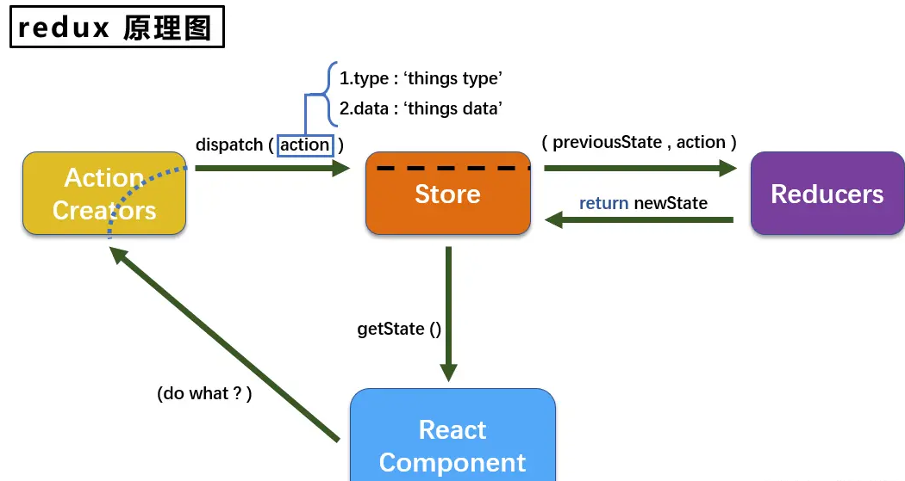

## redux 的使用和思想

### 一、概念介绍
    2015年，Redux 出现，将 Flux 与函数式编程结合一起，很短时间内就成为了最热门的前端架构。
 #### （一）什么场景适合使用
 从组件的角度来看：
 * 某个组件的状态，需要共享
 * 某个状态需要在任何地方都可以拿到
 * 一个组件需要改变全局状态
 * 一个组件需要改变另一个组件的状态
  
#### （二）redux 中的角色

1. store
    就是保存数据的地方，你可以把它看成一个容器。整个应用只能有一个 Store。
   (1) 提供 `getState()` 方法获取 state；
   (2) 提供 `dispatch(action)` 方法更新 state；
   (3) 通过 `subscribe(listener)` 注册监听器;
   (4)通过 `subscribe(listener)` 返回的函数注销监听器。
2. Reducer
    指定了应用状态的变化如何响应 `actions` 并发送到 store 的
    （1）Store 收到 Action 以后，必须给出一个新的 State，这样 View 才会发生变化。这种 State 的计算过程就叫做 Reducer。
    （2）Reducer 是一个函数，它接受 Action 和当前 State 作为参数，返回一个新的 State。
3. Action
   把数据从应用传到store的有效载荷
   (1) State 的变化，会导致 View 的变化。但是，用户接触不到 State，只能接触到 View。所以，State 的变化必须是 View 导致的。Action 就是 View 发出的通知，表示 State 应该要发生变化了。
   (2) Action 是一个对象。其中的type属性是必须的，表示 Action 的名称。



### 二、redux 的使用
`step1:` 创建store.js
```javascript
import {createStore} from 'redux'

// 2. 创建reducer 状态修改具体执行者
function counter(state=0, action) {
    switch (action.type) {
        case 'INCREMENT':
            return state + 1
        case 'DECREMENT':
            return state - 1
        default:
            return state
    }
}

// 1. 创建store 有state和reducer
const store = createStore(counter)

export default store
```

`step2:` 创建reduxTest.js
```javascript
import React, { Component } from 'react'
import store from './store'

import {Button} from 'antd'
import './index.css';
export default class reduxTest extends Component {
  increment = ()=>{
    store.dispatch({
      type:'INCREMENT'
    })
  }

  decrement =()=>{
    store.dispatch({
      type:'DECREMENT'
    })
  }
  render() {
    return (
      <div>
        <h3>{store.getState()}</h3>
        <Button type='success' onClick={this.increment}> +1 </Button>
        <Button type='success' onClick={this.decrement}> -1 </Button>
      </div>
    )
  }
}

```

`step3:` index.js
```javascript
import React from 'react';
import ReactDOM from 'react-dom/client';
import store from './store';
import ReduxTest from './reduxTest'

let root= ReactDOM.createRoot(document.getElementById('root'))

function render() {
 root.render(<ReduxTest />)
}
// 注册 订阅 监听 每次 state 更新时
store.subscribe(render)
```

总：这样就是一个完整的redux单向数据流过程

缺陷：每次state更新，都会重新render，大型应用中会造成不必要的`重复渲染`。

### 三、react-redux
为了解决上面那个重复渲染问题，所以我们使用`react-redux`
`React-Redux` 提供了`<Provider />`,使得 Redux store 都应用到你的应用程序

`step1:` 修改 index.js
```javascript
import React from 'react';
import ReactDOM from 'react-dom/client';
import store from './store';
import ReduxTest from './reduxTest'
import ReactReduxTest from './reactReduxTest'
import {Provider} from 'react-redux'

let root= ReactDOM.createRoot(document.getElementById('root'))

// react-redux 的使用 
// 1. 用Provider 把要用的组件包起来
function render() {
  root.render(
    <Provider store={store}>
      <ReactReduxTest />
    </Provider>
  )
 }

render()

// 注册 订阅 监听 每次 state 更新时
// store.subscribe(render)
```

`React-Redux` 提供了 `connect` 将组件连接到 store 的功能
`step2:` reactReduxTest.js
```javascript
import {Button} from 'antd'
import React, { Component } from 'react'
import {connect} from 'react-redux'

const mapStateToProps = (state)=>{
    return{
        num: state
    }
}

const mapDispatchToProps = (dispatch)=>{
    return{
        increment: ()=>{
            dispatch({type: 'INCREMENT'})
        },
        decrement: ()=>{
            dispatch({type: 'DECREMENT'})
        }
    }
}

class ReactReduxTest extends Component {
    render() {
      return (
        <div>
          <h3>{this.props.num}</h3>
          <Button type='success' onClick={this.props.increment}> +1 </Button>
          <Button type='success' onClick={this.props.decrement}> -1 </Button>
        </div>
      )
    }
  }

export default connect(mapStateToProps, mapDispatchToProps)(ReactReduxTest)
```

容器组件就是使用 `store.subscribe()` 从 Redux state 树中读取部分数据，并通过 props 来把这些数据提供给要渲染的组件。你可以手动来开发容器组件，但建议使用 React Redux 库的 connect() 方法来生成，这个方法做了性能优化来避免很多不必要的重复渲染。

使用connect()前，需要先定义mapStateToProps这个函数来指定如何把当前的Redux store state映射到展示组件的props中。

### 四、redux 中间件

利用redux中间件机制可以在实际action响应前执行其它额外的业务逻辑。
1. `redux-logger` 处理日志记录的中间件
2. `Redux-thunk` 处理异步action
  
#### `redux-logger`的使用

`step1:` store.js引入
```javascript
import {createStore ,applyMiddleware} from 'redux'
import logger from 'redux-logger';
// 创建reducer
function counter(state=0, action) {
    switch (action.type) {
        case 'INCREMENT':
            return state + 1
        case 'DECREMENT':
            return state - 1
        default:
            return state
    }
}


// 创建store 有state和reducer
const store = createStore(counter,applyMiddleware(logger))
export default store
```

#### `Redux-thunk`的使用

`step1:` store.js引入
```javascript
import {createStore ,applyMiddleware} from 'redux'
import logger from 'redux-logger';
import thunk from 'redux-thunk';
// 创建reducer
function counter(state=0, action) {
    switch (action.type) {
        case 'INCREMENT':
            return state + 1
        case 'DECREMENT':
            return state - 1
        default:
            return state
    }
}

// 创建store 有state和reducer
const store = createStore(counter,applyMiddleware(logger,thunk))

export default store
```

`step2:` 在 reactThunk.js修改
```javascript
import {Button} from 'antd'
import {connect} from 'react-redux'
import React, { Component } from 'react'


const asyncAdd =()=>{
    return (dispatch ,getState)=>{
        setTimeout(() => {
            dispatch({type: 'INCREMENT'})
        }, 1000);
    }
}

const mapStateToProps = (state)=>{
    return{
        num: state
    }
}

const mapDispatchToProps = (dispatch)=>{
    return{
        increment: ()=>{
            dispatch({type: 'INCREMENT'})
        },
        decrement: ()=>{
            dispatch({type: 'DECREMENT'})
        },
        asyncIncrement: ()=>{
            dispatch(asyncAdd())
        }
    }
}

class ReactReduxTest extends Component {
    render() {
      return (
        <div>
          <h3>{this.props.num}</h3>
          <Button type='success' onClick={this.props.increment}> +1 </Button>
          <Button type='success' onClick={this.props.decrement}> -1 </Button>
          <Button type='success' onClick={this.props.asyncIncrement}> 异步+1 </Button>

        </div>
      )
    }
  }

export default connect(mapStateToProps, mapDispatchToProps)(ReactReduxTest)
```

### 五、合并 reducer
  使用 `combineReducers` 进行复合，实现状态的模块化
  `step1:` store.js
```javascript
import {createStore,applyMiddleware,combineReducers} from 'redux';
import logger from 'redux-logger';
import thunk from 'redux-thunk';
import counter from './couter.reducer';

export default createStore(
    combineReducers({
        counter
    }), applyMiddleware(logger,thunk));
```
